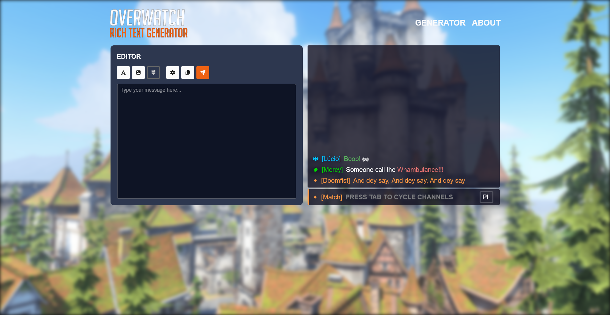

# Overwatch Rich Text Generator

Web based rich text editor used to visually build colorful messages with glyphs.



## Warning!

> Unfortunately, as of August 5th 2025 the exploit used to send rich messages is no longer functional, as it has been patched by Blizzard.
> This makes the project effectively useless, however I publish it in hopes of it being useful as a reference for someone in the future.
> A resource you may find useful in this projects is a manually curated catalogue of sendable glyphs, located at: /data/glyphs.json

## Usage

First, install the dependencies:

```
npm i
```

Build the project:

```
npm run build
```

Run the project on a local preview server:

```
npm run preview
```

Alternatively use a development server with:

```
npm run dev
```
